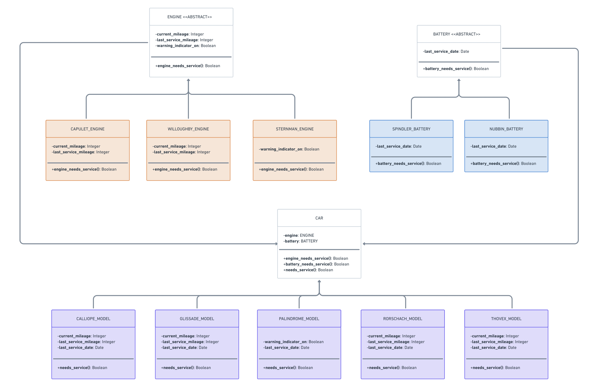

# Lyft Back-End Engineering Virtual Experience Program

> This repository contains the code for the Back-End Engineering Virtual Experience Program by Lyft

### Concepts Covered

- UML Diagrams
- Software Design Patterns
- Python Scripting
- Python Modules
- Python OOPS
- Unit Testing
- Test-Driven Development (TDD)

### UML Diagram

